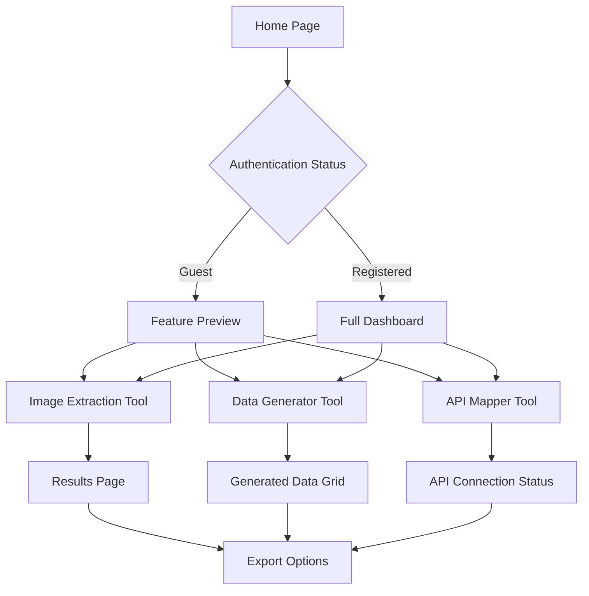

## 1. Product Overview

An AI-powered web application that provides three specialized tools for image analysis, data generation, and API integration. The platform enables users to extract insights from images, generate structured data through AI, and create seamless API connections with data transformation capabilities.

The application targets developers, data analysts, and businesses who need intelligent automation tools for visual content analysis, dynamic data generation, and API workflow integration.

## 2. Core Features

### 2.1 User Roles

| Role | Registration Method | Core Permissions |
|------|---------------------|------------------|
| Guest User | No registration required | Limited usage quota for all features |
| Registered User | Email registration | Full access to all features with usage tracking |
| Premium User | Subscription upgrade | Higher usage limits and priority processing |

### 2.2 Feature Module

The application consists of the following main pages:

1. **Home page**: Feature overview, navigation menu, usage statistics dashboard.
2. **Image Metadata Extraction page**: Multi-image upload interface, metadata display, export options.
3. **Data Generator page**: Header configuration, data generation controls, results grid.
4. **API Endpoint Mapper page**: Endpoint configuration, mapping interface, transformation builder.
5. **Login/Register page**: User authentication, account management.

### 2.3 Page Details

| Page Name | Module Name | Feature description |
|-----------|-------------|---------------------|
| Home page | Hero section | Display application title and brief description of three main features with animated icons. |
| Home page | Navigation menu | Horizontal navigation bar with links to all tools and user account section. |
| Home page | Usage dashboard | Show current usage statistics and remaining quotas for authenticated users. |
| Home page | Feature cards | Three interactive cards showcasing each tool with preview animations. |
| Image Metadata Extraction page | Upload interface | Drag-and-drop zone supporting multiple image formats (JPG, PNG, GIF, WebP) with preview thumbnails. |
| Image Metadata Extraction page | Processing controls | Start analysis button with progress indicator and cancel option. |
| Image Metadata Extraction page | Results display | Tabbed interface showing extracted objects, colors, text content, and general metadata. |
| Image Metadata Extraction page | Export options | Download results as JSON, CSV, or copy to clipboard functionality. |
| Data Generator page | Header configuration | Input fields for defining horizontal and vertical headers with data type selection. |
| Data Generator page | Generation controls | AI model selection, creativity level slider, and generate button. |
| Data Generator page | Results grid | Interactive table displaying generated data with inline editing capabilities. |
| Data Generator page | Data actions | Export to CSV, copy table, clear results, and save template options. |
| API Endpoint Mapper page | Endpoint configuration | Input fields for source and target API endpoints with method selection. |
| API Endpoint Mapper page | Authentication setup | API key or token input fields with encryption indicators. |
| API Endpoint Mapper page | Mapping interface | Visual drag-and-drop field mapping between source and target schemas. |
| API Endpoint Mapper page | Transformation builder | Rule-based data transformation with function library and preview. |
| API Endpoint Mapper page | Test connection | Validate endpoints and test mapping with sample data. |
| Login/Register page | Authentication form | Email/password login with social login options (Google, GitHub). |
| Login/Register page | Registration form | Email verification, password strength indicator, and terms acceptance. |

## 3. Core Process

### Guest User Flow
1. User lands on Home page and views available features
2. User navigates to any tool page with limited access
3. System displays usage quota warnings when approaching limits
4. User prompted to register for full access

### Registered User Flow
1. User logs in through authentication page
2. Dashboard displays personalized usage statistics
3. User accesses full features with higher quotas
4. Usage tracked and displayed in real-time

### Premium User Flow
1. User upgrades through subscription interface
2. System unlocks priority processing and higher limits
3. Advanced features like batch processing become available
4. Detailed analytics and usage reports accessible

## 4. User Interface Design

### 4.1 Design Style

- **Primary Colors**: Deep purple (#6B46C1) for primary actions, light gray (#F3F4F6) for backgrounds
- **Secondary Colors**: Teal (#14B8A6) for success states, orange (#F59E0B) for warnings
- **Button Style**: Rounded corners (8px radius), subtle shadows, hover animations
- **Typography**: Inter font family, 16px base size, clear hierarchy with H1-H6 sizes
- **Layout**: Card-based design with consistent spacing (8px grid system)
- **Icons**: Modern line icons from Lucide React library with consistent stroke width
- **Animations**: Smooth transitions (200-300ms), loading skeletons, micro-interactions

### 4.2 Page Design Overview

| Page Name | Module Name | UI Elements |
|-----------|-------------|-------------|
| Home page | Hero section | Gradient background with animated particles, centered title with 48px font, subtitle at 18px, three feature icons with hover effects. |
| Home page | Navigation bar | Fixed top navigation with logo (32px height), menu items with 16px font, user avatar dropdown, mobile hamburger menu. |
| Image Metadata Extraction page | Upload zone | Dashed border dropzone (4px border), upload icon (64px), file type indicators, progress bar with percentage display. |
| Image Metadata Extraction page | Results tabs | Horizontal tab navigation with active state highlighting, content cards with consistent spacing, copy buttons with tooltips. |
| Data Generator page | Header inputs | Labeled input fields with 12px labels, 16px input text, add/remove buttons with consistent sizing, data type dropdowns. |
| Data Generator page | Results table | Striped rows for readability, sortable column headers, inline edit indicators, pagination controls at bottom. |
| API Endpoint Mapper page | Endpoint inputs | URL input fields with validation indicators, method selection dropdowns, authentication toggle switches. |
| API Endpoint Mapper page | Mapping canvas | Visual connection lines between fields, drag handles for mapping creation, color-coded field types. |

### 4.3 Responsiveness

- **Mobile-first approach**: Base design optimized for 320px width
- **Breakpoints**: 640px (sm), 768px (md), 1024px (lg), 1280px (xl)
- **Touch optimization**: Larger tap targets (44px minimum), swipe gestures for navigation
- **Adaptive layouts**: Single column on mobile, multi-column on desktop
- **Responsive images**: Automatic scaling with WebP format support
- **Performance**: Lazy loading for images, code splitting for optimal loading