## 1. Architecture Design


## 2. Technology Description

- **Frontend**: React@18 + TypeScript@5 + Vite@5 + TailwindCSS@3
- **UI Components**: shadcn/ui + Radix UI + Lucide React
- **State Management**: Zustand + React Query
- **Backend**: Supabase (PostgreSQL, Auth, Storage)
- **AI Integration**: OpenAI API, Google Vision API
- **API Testing**: Axios + React Hook Form + Zod validation

## 3. Route Definitions

| Route | Purpose |
|-------|---------|
| / | Home page with feature overview and navigation |
| /auth/login | User authentication and login form |
| /auth/register | New user registration with email verification |
| /tools/image-extraction | Image metadata extraction tool interface |
| /tools/data-generator | AI-powered data generation tool |
| /tools/api-mapper | API endpoint mapping and transformation tool |
| /dashboard | User dashboard with usage statistics |
| /profile | User profile and account settings |

## 4. API Definitions

### 4.1 Authentication APIs

```
POST /api/auth/login
```

Request:
| Param Name | Param Type | isRequired | Description |
|------------|------------|------------|-------------|
| email | string | true | User email address |
| password | string | true | User password |

Response:
| Param Name | Param Type | Description |
|------------|------------|-------------|
| user | object | User profile data |
| session | object | Authentication session token |
| error | string | Error message if login fails |

### 4.2 Image Processing APIs

```
POST /api/images/analyze
```

Request:
| Param Name | Param Type | isRequired | Description |
|------------|------------|------------|-------------|
| images | File[] | true | Array of image files (max 10MB each) |
| analysis_type | string | false | Type of analysis: 'objects', 'text', 'colors', 'all' |

Response:
| Param Name | Param Type | Description |
|------------|------------|-------------|
| results | array | Array of analysis results for each image |
| metadata | object | Processing metadata and confidence scores |
| usage | object | API usage statistics |

### 4.3 Data Generation APIs

```
POST /api/data/generate
```

Request:
| Param Name | Param Type | isRequired | Description |
|------------|------------|-------------|
| horizontal_headers | string[] | true | Array of horizontal header names |
| vertical_headers | string[] | true | Array of vertical header names |
| data_types | object | false | Data type specifications for each intersection |
| creativity_level | number | false | Creativity level 0-1 (default: 0.5) |

Response:
| Param Name | Param Type | Description |
|------------|------------|-------------|
| generated_data | array | 2D array of generated data |
| confidence_scores | array | Confidence scores for each generated cell |
| template_id | string | ID for saving/retrieving template |

### 4.4 API Mapping APIs

```
POST /api/mapping/test
```

Request:
| Param Name | Param Type | isRequired | Description |
|------------|------------|-------------|
| source_endpoint | string | true | Source API endpoint URL |
| target_endpoint | string | true | Target API endpoint URL |
| source_auth | object | false | Authentication details for source API |
| target_auth | object | false | Authentication details for target API |
| mapping_rules | array | true | Field mapping and transformation rules |

Response:
| Param Name | Param Type | Description |
|------------|------------|-------------|
| connection_status | string | Status of both API connections |
| sample_data | object | Sample data from source API |
| transformed_data | object | Data after applying mapping rules |
| errors | array | Any errors encountered during mapping |

## 5. Server Architecture Diagram


## 6. Data Model

### 6.1 Data Model Definition

```mermaid
erDiagram
    USER ||--o{ IMAGE_ANALYSIS : performs
    USER ||--o{ DATA_GENERATION : creates
    USER ||--o{ API_MAPPING : configures
    USER ||--o{ USAGE_TRACKING : generates
    IMAGE_ANALYSIS ||--o{ ANALYSIS_RESULT : contains
    DATA_GENERATION ||--o{ GENERATED_DATASET : produces
    API_MAPPING ||--o{ MAPPING_RULE : defines

    USER {
        uuid id PK
        string email UK
        string password_hash
        string name
        string role
        timestamp created_at
        timestamp last_login
        json preferences
    }

    IMAGE_ANALYSIS {
        uuid id PK
        uuid user_id FK
        string status
        json image_metadata
        json analysis_results
        timestamp created_at
        timestamp completed_at
        integer processing_time
    }

    ANALYSIS_RESULT {
        uuid id PK
        uuid analysis_id FK
        string image_url
        json objects_detected
        json text_extracted
        json color_palette
        json metadata
        float confidence_score
    }

    DATA_GENERATION {
        uuid id PK
        uuid user_id FK
        json horizontal_headers
        json vertical_headers
        json data_types
        float creativity_level
        json generated_data
        timestamp created_at
        boolean is_template
    }

    GENERATED_DATASET {
        uuid id PK
        uuid generation_id FK
        json dataset_content
        integer row_count
        integer column_count
        json validation_results
        timestamp generated_at
    }

    API_MAPPING {
        uuid id PK
        uuid user_id FK
        string source_endpoint
        string target_endpoint
        json source_auth
        json target_auth
        json mapping_configuration
        boolean is_active
        timestamp created_at
        timestamp last_used
    }

    MAPPING_RULE {
        uuid id PK
        uuid mapping_id FK
        string source_field
        string target_field
        string transformation_type
        json transformation_config
        integer execution_order
        boolean is_required
    }

    USAGE_TRACKING {
        uuid id PK
        uuid user_id FK
        string feature_type
        string operation_type
        json request_details
        integer tokens_used
        timestamp created_at
        string ip_address
    }
```



### 6.2 Data Definition Language

**Users Table**
```sql
CREATE TABLE users (
    id UUID PRIMARY KEY DEFAULT gen_random_uuid(),
    email VARCHAR(255) UNIQUE NOT NULL,
    password_hash VARCHAR(255) NOT NULL,
    name VARCHAR(100) NOT NULL,
    role VARCHAR(20) DEFAULT 'user' CHECK (role IN ('user', 'premium', 'admin')),
    preferences JSONB DEFAULT '{}',
    created_at TIMESTAMP WITH TIME ZONE DEFAULT NOW(),
    last_login TIMESTAMP WITH TIME ZONE,
    is_active BOOLEAN DEFAULT true
);

-- Indexes
CREATE INDEX idx_users_email ON users(email);
CREATE INDEX idx_users_created_at ON users(created_at DESC);
```

**Image Analysis Table**
```sql
CREATE TABLE image_analyses (
    id UUID PRIMARY KEY DEFAULT gen_random_uuid(),
    user_id UUID REFERENCES users(id) ON DELETE CASCADE,
    status VARCHAR(20) DEFAULT 'pending' CHECK (status IN ('pending', 'processing', 'completed', 'failed')),
    image_metadata JSONB NOT NULL DEFAULT '{}',
    analysis_results JSONB NOT NULL DEFAULT '{}',
    created_at TIMESTAMP WITH TIME ZONE DEFAULT NOW(),
    completed_at TIMESTAMP WITH TIME ZONE,
    processing_time INTEGER,
    error_message TEXT
);

-- Indexes
CREATE INDEX idx_image_analyses_user_id ON image_analyses(user_id);
CREATE INDEX idx_image_analyses_status ON image_analyses(status);
CREATE INDEX idx_image_analyses_created_at ON image_analyses(created_at DESC);
```

**Data Generation Table**
```sql
CREATE TABLE data_generations (
    id UUID PRIMARY KEY DEFAULT gen_random_uuid(),
    user_id UUID REFERENCES users(id) ON DELETE CASCADE,
    horizontal_headers JSONB NOT NULL DEFAULT '[]',
    vertical_headers JSONB NOT NULL DEFAULT '[]',
    data_types JSONB NOT NULL DEFAULT '{}',
    creativity_level FLOAT DEFAULT 0.5 CHECK (creativity_level >= 0 AND creativity_level <= 1),
    generated_data JSONB NOT NULL DEFAULT '{}',
    created_at TIMESTAMP WITH TIME ZONE DEFAULT NOW(),
    is_template BOOLEAN DEFAULT false,
    template_name VARCHAR(100)
);

-- Indexes
CREATE INDEX idx_data_generations_user_id ON data_generations(user_id);
CREATE INDEX idx_data_generations_template ON data_generations(is_template);
```

**API Mapping Table**
```sql
CREATE TABLE api_mappings (
    id UUID PRIMARY KEY DEFAULT gen_random_uuid(),
    user_id UUID REFERENCES users(id) ON DELETE CASCADE,
    source_endpoint VARCHAR(500) NOT NULL,
    target_endpoint VARCHAR(500) NOT NULL,
    source_auth JSONB DEFAULT '{}',
    target_auth JSONB DEFAULT '{}',
    mapping_configuration JSONB NOT NULL DEFAULT '{}',
    is_active BOOLEAN DEFAULT true,
    created_at TIMESTAMP WITH TIME ZONE DEFAULT NOW(),
    last_used TIMESTAMP WITH TIME ZONE,
    success_count INTEGER DEFAULT 0,
    failure_count INTEGER DEFAULT 0
);

-- Indexes
CREATE INDEX idx_api_mappings_user_id ON api_mappings(user_id);
CREATE INDEX idx_api_mappings_active ON api_mappings(is_active);
```

**Usage Tracking Table**
```sql
CREATE TABLE usage_tracking (
    id UUID PRIMARY KEY DEFAULT gen_random_uuid(),
    user_id UUID REFERENCES users(id) ON DELETE CASCADE,
    feature_type VARCHAR(50) NOT NULL,
    operation_type VARCHAR(50) NOT NULL,
    request_details JSONB DEFAULT '{}',
    tokens_used INTEGER DEFAULT 0,
    created_at TIMESTAMP WITH TIME ZONE DEFAULT NOW(),
    ip_address INET
);

-- Indexes
CREATE INDEX idx_usage_tracking_user_id ON usage_tracking(user_id);
CREATE INDEX idx_usage_tracking_feature ON usage_tracking(feature_type);
CREATE INDEX idx_usage_tracking_created_at ON usage_tracking(created_at DESC);
```

**Row Level Security Policies**
```sql
-- Enable RLS
ALTER TABLE users ENABLE ROW LEVEL SECURITY;
ALTER TABLE image_analyses ENABLE ROW LEVEL SECURITY;
ALTER TABLE data_generations ENABLE ROW LEVEL SECURITY;
ALTER TABLE api_mappings ENABLE ROW LEVEL SECURITY;
ALTER TABLE usage_tracking ENABLE ROW LEVEL SECURITY;

-- Create policies
CREATE POLICY "Users can view own profile" ON users FOR SELECT USING (auth.uid() = id);
CREATE POLICY "Users can update own profile" ON users FOR UPDATE USING (auth.uid() = id);
CREATE POLICY "Users can view own analyses" ON image_analyses FOR SELECT USING (auth.uid() = user_id);
CREATE POLICY "Users can create analyses" ON image_analyses FOR INSERT WITH CHECK (auth.uid() = user_id);
CREATE POLICY "Users can view own generations" ON data_generations FOR SELECT USING (auth.uid() = user_id);
CREATE POLICY "Users can create generations" ON data_generations FOR INSERT WITH CHECK (auth.uid() = user_id);
CREATE POLICY "Users can view own mappings" ON api_mappings FOR SELECT USING (auth.uid() = user_id);
CREATE POLICY "Users can create mappings" ON api_mappings FOR INSERT WITH CHECK (auth.uid() = user_id);
CREATE POLICY "Users can update own mappings" ON api_mappings FOR UPDATE USING (auth.uid() = user_id);
```