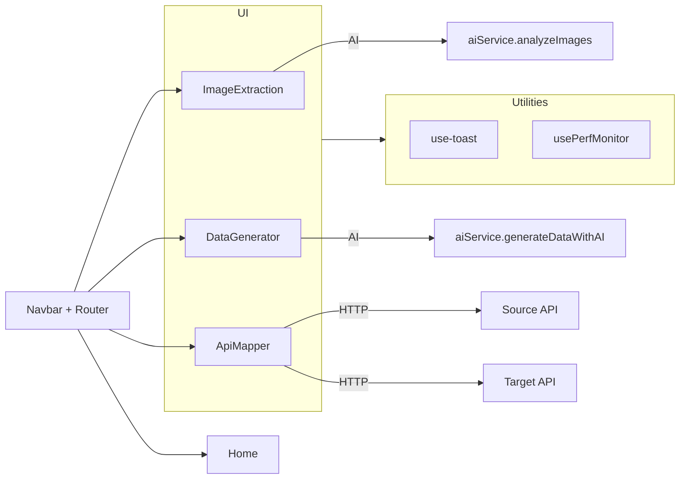

# System Architecture (Mermaid)

```mermaid
flowchart LR
  A[Navbar + Router] --> B[Home]
  A --> C[ImageExtraction]
  A --> D[DataGenerator]
  A --> E[ApiMapper]
  C -->|AI| S[aiService.analyzeImages]
  D -->|AI| S2[aiService.generateDataWithAI]
  E -->|HTTP| X[Source API]
  E -->|HTTP| Y[Target API]
  subgraph UI
  C
  D
  E
  end
  subgraph Utilities
  U1[use-toast]
  U2[usePerfMonitor]
  end
  UI --> Utilities
```

